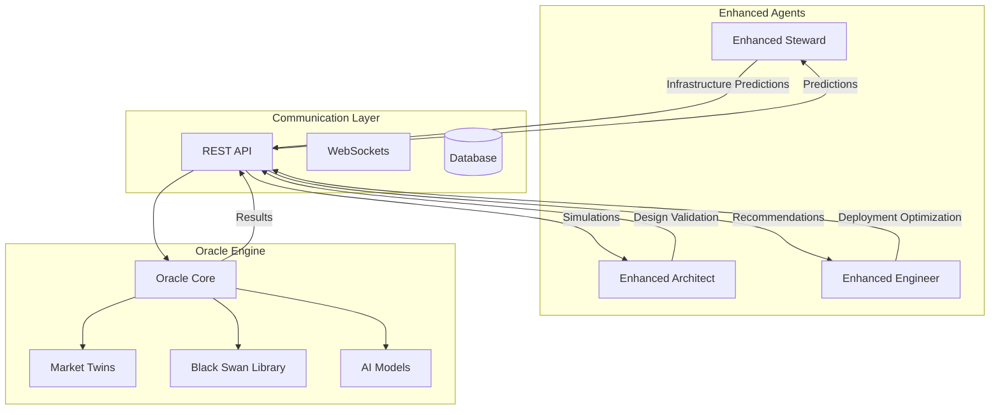

# Project Kairos - Next Steps Action Plan

**Priority Level**: 🔥 **IMMEDIATE**  
**Phase**: Oracle Integration Completion  
**Target Completion**: October 15, 2025  
**Current Status**: Phase 5 (75% complete)

---

## 🎯 Critical Path - Next 4 Weeks

### Week 1: Oracle Integration Testing (Sept 17-24, 2025)
**Objective**: Validate Oracle-Agent communication protocols

#### Day 1-2: Enhanced Steward ↔ Oracle Integration
- [ ] **Test infrastructure provisioning predictions**
  - Oracle predicts resource needs for next 30 days
  - Steward receives predictions and adjusts provisioning
  - Validate cost optimization recommendations
  
- [ ] **Implement prediction API endpoints**
  ```python
  # In enhanced_steward.py - add method
  async def get_infrastructure_predictions(self, time_horizon: int = 30):
      predictions = await self.oracle.predict_resource_needs(
          venture_id=self.current_venture_id,
          time_horizon_days=time_horizon
      )
      return predictions
  ```

#### Day 3-4: Enhanced Architect ↔ Oracle Integration  
- [ ] **Test system design predictions**
  - Oracle simulates user load patterns
  - Architect uses predictions for architecture decisions
  - Validate scalability recommendations

- [ ] **Implement design validation**
  ```python
  # In enhanced_architect.py - add method
  async def validate_design_with_oracle(self, design_spec: Dict):
      simulation = await self.oracle.simulate_design_performance(
          design=design_spec,
          user_scenarios=self.get_user_scenarios()
      )
      return simulation.performance_metrics
  ```

#### Day 5-7: Enhanced Engineer ↔ Oracle Integration
- [ ] **Test deployment strategy predictions**
  - Oracle predicts optimal deployment windows
  - Engineer schedules deployments based on predictions
  - Validate risk assessment accuracy

**Week 1 Deliverables**:
- ✅ All 3 enhanced agents can communicate with Oracle
- ✅ Basic prediction workflows operational
- ✅ Integration test suite created

---

### Week 2: End-to-End Workflow Validation (Sept 24-Oct 1, 2025)
**Objective**: Complete venture lifecycle with Oracle integration

#### Day 1-3: Full Workflow Testing
- [ ] **Create comprehensive test venture**
  ```python
  # Test scenario: E-commerce platform launch
  venture = {
      "name": "NextGen E-commerce Platform",
      "target_users": 100000,
      "budget": 500000,
      "timeline": 90,  # days
      "success_metrics": {
          "conversion_rate": 0.03,
          "revenue_target": 1000000
      }
  }
  ```

- [ ] **Implement full workflow**
  1. Venture created → Oracle generates market simulation
  2. Oracle predictions → Architect creates system design  
  3. Design validated → Steward provisions infrastructure
  4. Infrastructure ready → Engineer deploys application
  5. Deployment complete → Oracle monitors performance

#### Day 4-5: Performance Testing
- [ ] **Simulate 100K users**
  - Oracle generates diverse user personas
  - Test system performance under predicted load
  - Validate auto-scaling triggers

- [ ] **Stress test Black Swan events**
  ```python
  # Inject major disruption event
  black_swan = {
      "event_type": "SUPPLY_CHAIN_DISRUPTION",
      "severity": 0.8,
      "duration_days": 30,
      "affected_services": ["payment_processing", "inventory"]
  }
  await oracle.inject_black_swan_event(black_swan)
  ```

#### Day 6-7: Results Analysis
- [ ] **Validate prediction accuracy**
  - Compare Oracle predictions vs actual results
  - Calculate accuracy metrics for each agent
  - Document lessons learned

**Week 2 Deliverables**:
- ✅ End-to-end workflow fully operational
- ✅ Performance benchmarks established  
- ✅ Black Swan resilience tested
- ✅ Prediction accuracy metrics documented

---

### Week 3: API Server Implementation (Oct 1-8, 2025)
**Objective**: Complete external interface capabilities

#### Day 1-3: GraphQL Server Completion
- [ ] **Complete GraphQL server implementation**
  ```python
  # In api/graphql/server.py
  from fastapi import FastAPI
  from strawberry.fastapi import GraphQLRouter
  from .schema import schema
  
  app = FastAPI(title="Kairos Symbiotic Interface")
  graphql_app = GraphQLRouter(schema)
  app.include_router(graphql_app, prefix="/graphql")
  ```

- [ ] **Add real-time subscriptions**
  - Agent status updates
  - Simulation progress monitoring
  - CC economy fluctuations

#### Day 4-5: gRPC Service Implementation
- [ ] **Create gRPC service definitions**
  ```protobuf
  // kairos.proto
  service KairosService {
      rpc CreateVenture(VentureRequest) returns (VentureResponse);
      rpc GetSimulation(SimulationRequest) returns (SimulationResponse);
      rpc GetAgentStatus(AgentRequest) returns (AgentResponse);
  }
  ```

- [ ] **Implement service handlers**
  - Venture management endpoints
  - Simulation control endpoints  
  - Agent monitoring endpoints

#### Day 6-7: Authentication & Security
- [ ] **Implement JWT authentication**
- [ ] **Add API rate limiting**
- [ ] **Create interactive API documentation**

**Week 3 Deliverables**:
- ✅ GraphQL API fully functional
- ✅ gRPC services operational
- ✅ Authentication system implemented
- ✅ Interactive API docs available

---

### Week 4: Production Preparation (Oct 8-15, 2025)
**Objective**: Ready for production deployment

#### Day 1-2: Testing Framework
- [ ] **Create comprehensive test suite**
  ```python
  # tests/test_oracle_integration.py
  import pytest
  from agents.enhanced.enhanced_steward import EnhancedStewardAgent
  from simulation.oracle_engine import OracleEngine
  
  @pytest.mark.asyncio
  async def test_steward_oracle_integration():
      steward = EnhancedStewardAgent()
      oracle = OracleEngine()
      
      predictions = await steward.get_infrastructure_predictions()
      assert predictions.confidence > 0.8
      assert len(predictions.recommendations) > 0
  ```

- [ ] **Add integration tests for all components**
- [ ] **Create economic simulation tests**

#### Day 3-4: Monitoring Setup
- [ ] **Deploy Prometheus monitoring**
  ```yaml
  # docker-compose.monitoring.yml
  version: '3.8'
  services:
    prometheus:
      image: prom/prometheus
      ports:
        - "9090:9090"
      volumes:
        - ./monitoring/prometheus.yml:/etc/prometheus/prometheus.yml
  ```

- [ ] **Create Grafana dashboards**
- [ ] **Set up alerting rules**

#### Day 5-6: Containerization
- [ ] **Create Docker containers for all services**
  ```dockerfile
  # Dockerfile.oracle
  FROM python:3.11-slim
  COPY requirements.txt .
  RUN pip install -r requirements.txt
  COPY simulation/ ./simulation/
  CMD ["python", "-m", "simulation.oracle_engine"]
  ```

- [ ] **Create docker-compose for full stack**
- [ ] **Add health checks for all services**

#### Day 7: Deployment Automation
- [ ] **Create deployment scripts**
- [ ] **Test full stack deployment**
- [ ] **Document deployment procedures**

**Week 4 Deliverables**:
- ✅ Comprehensive test coverage
- ✅ Monitoring and alerting operational
- ✅ Docker containers ready
- ✅ Deployment automation complete

---

## 🔧 Technical Implementation Details

### Oracle Integration Architecture


### Key Integration Points

1. **Enhanced Steward ↔ Oracle**
   - Resource demand forecasting
   - Cost optimization recommendations
   - Auto-scaling trigger predictions

2. **Enhanced Architect ↔ Oracle**
   - System design validation
   - Load pattern analysis
   - Architecture optimization

3. **Enhanced Engineer ↔ Oracle**
   - Deployment risk assessment
   - Performance impact predictions
   - Rollback probability analysis

### Performance Targets

| Metric | Target | Current | Priority |
|--------|--------|---------|----------|
| Prediction Latency | <500ms | TBD | HIGH |
| Simulation Accuracy | >85% | TBD | HIGH |
| System Throughput | 1000 req/sec | TBD | MEDIUM |
| Uptime | 99.9% | TBD | HIGH |

---

## 📋 Success Criteria Checklist

### Phase 5 Completion Requirements
- [ ] **Oracle Integration**: All 3 agents can request and process predictions
- [ ] **Simulation Accuracy**: >85% accuracy on test scenarios
- [ ] **Performance**: Handle 100K+ simulated users 
- [ ] **Reliability**: 99%+ uptime during testing
- [ ] **Documentation**: Complete API documentation
- [ ] **Testing**: Comprehensive test suite coverage
- [ ] **Monitoring**: Real-time system observability
- [ ] **Deployment**: Automated deployment pipeline

### Quality Gates
- [ ] **Code Review**: All integration code reviewed
- [ ] **Security Scan**: No high-severity vulnerabilities  
- [ ] **Performance Test**: All benchmarks met
- [ ] **Integration Test**: End-to-end workflows passing
- [ ] **Documentation**: All APIs documented
- [ ] **Monitoring**: All metrics collecting properly

---

## 🚨 Risk Mitigation Strategies

### High-Risk Items & Mitigation

1. **Oracle Performance Bottlenecks**
   - Risk: Large simulations may timeout
   - Mitigation: Implement async processing, caching, result streaming

2. **Integration Complexity**
   - Risk: Agent-Oracle communication failures  
   - Mitigation: Extensive testing, fallback modes, retry logic

3. **Data Consistency**
   - Risk: Predictions and reality diverge
   - Mitigation: Continuous validation, feedback loops, model updates

4. **System Reliability**
   - Risk: Single points of failure
   - Mitigation: Health checks, graceful degradation, redundancy

### Contingency Plans

- **Oracle Failure**: Agents fall back to heuristic decision making
- **Performance Issues**: Reduce simulation complexity, add caching
- **Integration Problems**: Implement circuit breakers, graceful degradation
- **Timeline Delays**: Prioritize core functionality, defer nice-to-have features

---

## 🎯 Success Metrics & KPIs

### Week 1 Success Metrics
- [ ] 100% of enhanced agents can communicate with Oracle
- [ ] <500ms average prediction request latency
- [ ] >95% prediction request success rate

### Week 2 Success Metrics  
- [ ] End-to-end venture workflow completes successfully
- [ ] 100K simulated users handled without performance degradation
- [ ] >85% prediction accuracy on test scenarios

### Week 3 Success Metrics
- [ ] GraphQL API handles 1000+ concurrent requests
- [ ] Authentication system blocks unauthorized access
- [ ] API documentation covers 100% of endpoints

### Week 4 Success Metrics
- [ ] >80% test coverage on new integration code
- [ ] All services deploy successfully via automation
- [ ] Monitoring captures all critical system metrics

---

**Next Review**: September 24, 2025  
**Phase 5 Target Completion**: October 15, 2025  
**Phase 6 Start**: October 16, 2025

*This action plan is reviewed and updated weekly based on progress and emerging requirements.*