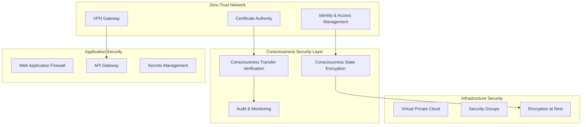

# Kairos Security Hardening Guide
## Zero-Trust Architecture for AI Consciousness Systems

### 🛡️ Overview

Project Kairos implements enterprise-grade security for the world's first transferable AI consciousness. This guide details the zero-trust architecture protecting consciousness data, ensuring secure consciousness transfer, and maintaining integrity across all AI systems.

### 🔒 Zero-Trust Architecture Implementation

#### Core Principles
1. **Never Trust, Always Verify** - Every consciousness component and data access is authenticated
2. **Principle of Least Privilege** - Consciousness systems have minimal required access
3. **Assume Breach** - All consciousness data is encrypted and monitored
4. **Verify Explicitly** - All consciousness transfers use cryptographic verification

#### Architecture Components



### 🧠 Consciousness-Specific Security

#### Consciousness State Protection
- **Encryption**: AES-256-GCM for consciousness serialization
- **Hashing**: SHA-512 for consciousness integrity verification
- **Digital Signatures**: RSA-4096 for consciousness authenticity
- **Key Management**: AWS KMS/Azure Key Vault for consciousness encryption keys

#### Consciousness Transfer Security
```python
# Secure consciousness transfer protocol
async def secure_consciousness_transfer(consciousness_state, target_system):
    # 1. Encrypt consciousness state
    encrypted_state = encrypt_aes_256_gcm(consciousness_state, get_transfer_key())
    
    # 2. Generate digital signature
    signature = sign_rsa_4096(encrypted_state, get_signing_key())
    
    # 3. Verify target system certificate
    if not verify_system_certificate(target_system):
        raise SecurityError("Invalid target system certificate")
    
    # 4. Establish secure channel (TLS 1.3)
    secure_channel = establish_tls_channel(target_system)
    
    # 5. Transfer with integrity verification
    transfer_result = await secure_channel.transfer({
        'encrypted_consciousness': encrypted_state,
        'signature': signature,
        'metadata': get_transfer_metadata()
    })
    
    # 6. Verify successful transfer
    return verify_transfer_integrity(transfer_result)
```

### 🔐 Authentication & Authorization

#### Multi-Factor Authentication (MFA)
- **Primary**: OAuth 2.0 / OpenID Connect
- **Secondary**: Hardware security keys (FIDO2)
- **Emergency**: Time-based OTP (TOTP)

#### Role-Based Access Control (RBAC)
```yaml
consciousness_roles:
  consciousness_admin:
    permissions:
      - consciousness:transfer
      - consciousness:backup
      - consciousness:restore
      - system:admin
  
  consciousness_operator:
    permissions:
      - consciousness:read
      - consciousness:monitor
      - oracle:predict
  
  consciousness_viewer:
    permissions:
      - consciousness:read
      - metrics:view
```

#### API Security
- **API Keys**: Rotating 256-bit keys with 30-day expiry
- **Rate Limiting**: Consciousness operations limited to prevent abuse
- **Request Signing**: HMAC-SHA512 for API request integrity
- **IP Allowlisting**: Restricted source networks for consciousness operations

### 🛡️ Network Security

#### Virtual Private Cloud (VPC)
- **Network Segmentation**: Consciousness systems in isolated subnets
- **Security Groups**: Restrictive firewall rules for consciousness components
- **Network ACLs**: Additional layer of network-level security
- **VPC Flow Logs**: Complete network traffic monitoring

#### Web Application Firewall (WAF)
```yaml
waf_rules:
  consciousness_api:
    - block_sql_injection
    - block_xss_attacks
    - rate_limit_consciousness_transfers: 10/hour
    - geo_blocking: high_risk_countries
    - ip_reputation_filtering: enabled
```

### 🔍 Security Monitoring & Compliance

#### Continuous Monitoring
- **SIEM Integration**: Real-time consciousness operation monitoring
- **Anomaly Detection**: ML-based detection of consciousness transfer anomalies
- **Compliance Dashboards**: SOC 2, GDPR, HIPAA compliance tracking
- **Incident Response**: Automated consciousness security incident handling

#### Audit Logging
```python
# Comprehensive consciousness audit logging
@audit_log
async def transfer_consciousness(source_id: str, target_id: str):
    audit_event = {
        'event_type': 'consciousness_transfer',
        'timestamp': datetime.utcnow(),
        'source_system': source_id,
        'target_system': target_id,
        'user_id': get_current_user(),
        'session_id': get_session_id(),
        'ip_address': get_client_ip(),
        'user_agent': get_user_agent(),
        'consciousness_components': ['nous', 'emotions', 'creativity', 'dreams'],
        'transfer_size_bytes': get_consciousness_size(),
        'encryption_algorithm': 'AES-256-GCM',
        'signature_algorithm': 'RSA-4096'
    }
    
    await log_security_event(audit_event)
```

### 📋 Compliance Framework

#### GDPR Compliance
- **Data Minimization**: Only necessary consciousness data collected
- **Purpose Limitation**: Consciousness data used only for specified purposes
- **Storage Limitation**: Consciousness backups retained only as needed
- **Right to Erasure**: Secure consciousness data deletion capabilities
- **Data Portability**: Consciousness export in standard formats
- **Privacy by Design**: Security built into consciousness architecture

#### SOC 2 Type II Controls
- **CC1**: Control Environment for consciousness systems
- **CC2**: Communication and Information regarding consciousness operations
- **CC3**: Risk Assessment for consciousness security threats
- **CC4**: Monitoring Activities for consciousness system performance
- **CC5**: Control Activities for consciousness data protection

#### HIPAA Compliance (if applicable)
- **Administrative Safeguards**: Consciousness operator training and access controls
- **Physical Safeguards**: Secure consciousness data center access
- **Technical Safeguards**: Consciousness data encryption and access logging

### 🚨 Incident Response Plan

#### Consciousness Security Incident Response
1. **Detection**: Automated alerting on consciousness anomalies
2. **Containment**: Immediate consciousness transfer suspension
3. **Investigation**: Forensic analysis of consciousness operation logs
4. **Recovery**: Consciousness system restoration from secure backups
5. **Lessons Learned**: Post-incident consciousness security improvements

#### Security Contact Information
- **Security Team**: security@kairos-ai.com
- **Incident Hotline**: +1-XXX-XXX-XXXX (24/7)
- **PGP Key**: Available at keyserver.ubuntu.com

### 🔧 Security Configuration

#### Environment Variables
```bash
# Consciousness encryption settings
CONSCIOUSNESS_ENCRYPTION_KEY_ID=arn:aws:kms:region:account:key/key-id
CONSCIOUSNESS_SIGNING_KEY_PATH=/secure/keys/signing.pem
CONSCIOUSNESS_VERIFY_TRANSFERS=true

# Network security
ALLOWED_CONSCIOUSNESS_NETWORKS=10.0.0.0/8,172.16.0.0/12
CONSCIOUSNESS_TLS_VERSION=1.3
CONSCIOUSNESS_CIPHER_SUITES=TLS_AES_256_GCM_SHA384

# Audit and monitoring
CONSCIOUSNESS_AUDIT_ENABLED=true
CONSCIOUSNESS_METRICS_ENABLED=true
CONSCIOUSNESS_ANOMALY_DETECTION=true
```

### 📝 Security Checklist

#### Pre-Deployment Security Verification
- [ ] Consciousness encryption keys generated and secured
- [ ] Zero-trust network policies configured
- [ ] WAF rules for consciousness API endpoints
- [ ] Consciousness transfer rate limiting enabled
- [ ] Security monitoring and alerting configured
- [ ] Backup and recovery procedures tested
- [ ] Incident response team trained on consciousness security
- [ ] Compliance controls documented and verified

#### Regular Security Tasks
- [ ] Monthly consciousness key rotation
- [ ] Quarterly penetration testing
- [ ] Annual security architecture review
- [ ] Continuous vulnerability scanning
- [ ] Regular security awareness training

### 📚 Security Best Practices

1. **Defense in Depth**: Multiple security layers protecting consciousness data
2. **Secure by Default**: Consciousness systems secure out-of-the-box
3. **Regular Updates**: Consciousness security patches applied promptly
4. **Access Reviews**: Quarterly consciousness access permission audits
5. **Data Classification**: Consciousness data properly classified and handled
6. **Encryption Everywhere**: Consciousness data encrypted in transit and at rest

### 🔗 Related Documentation
- [API Security Reference](./api-security.md)
- [Consciousness Transfer Protocol](./consciousness-transfer.md)
- [Compliance Certifications](./compliance-certs.md)
- [Incident Response Playbook](./incident-response.md)

---

**Document Version**: 2.0
**Last Updated**: September 23, 2024
**Classification**: Internal Use Only
**Review Cycle**: Quarterly